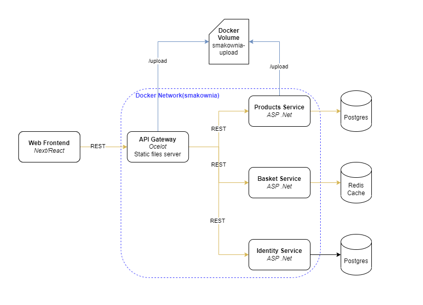
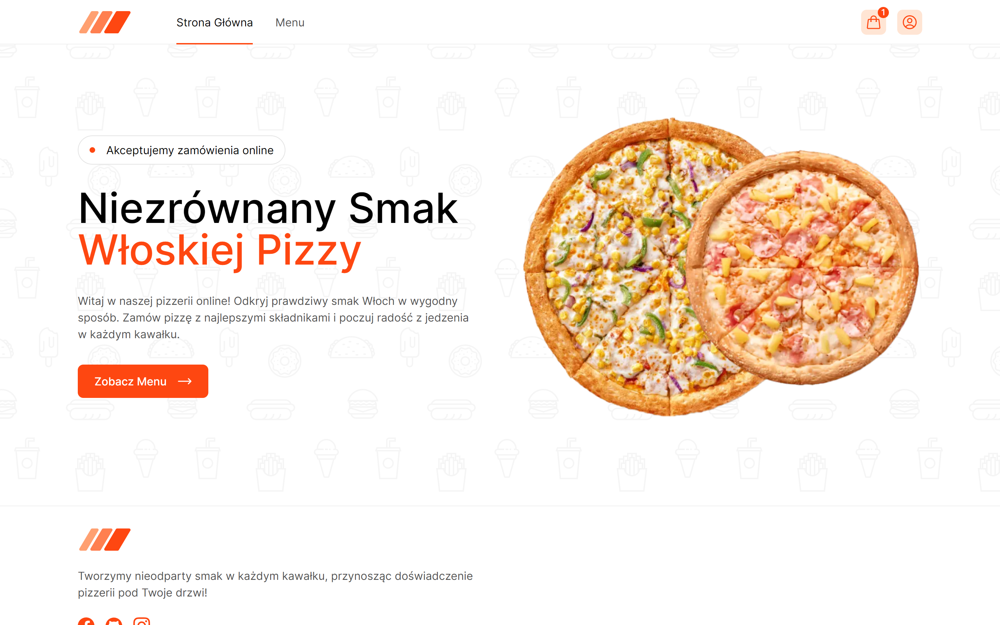

# Smakownia

Online pizzeria application, based on a simplified microservices architecture and Docker containers

https://github.com/user-attachments/assets/d9720fe5-edd1-406a-98f7-fed353a21f60

## Getting Started

> Make sure you have installed and configured docker in your environment.

Clone all repositories:

```bash
git clone --recurse-submodules https://github.com/smakownia/smakownia.git
```

Build and run each submodule:

```bash
cd sk-gateway
docker-compose build 
docker-compose -f docker-compose.override.yml up -d

cd ../sk-products
docker-compose build
docker-compose -f docker-compose.override.yml up -d

cd ../sk-basket
docker-compose build
docker-compose -f docker-compose.override.yml up -d

cd ../sk-identity
docker-compose build
docker-compose -f docker-compose.override.yml up -d

cd ../sk-frontend
docker-compose build
docker-compose up -d
```

## Technologies

### Gateway service

- ASP .NET core
- Ocelot
- Swagger

### Products service

- ASP .NET core
- Swagger
- Entity Framework Core
- Postgres
- CQRS
- DDD

### Basket service

- ASP .NET core
- Swagger
- Redis
- CQRS
- DDD

### Identity service

- ASP .NET core
- Swagger
- Postgres
- JWT

### Frontend service

- React
- TypeScript
- Next.js
- Tailwind CSS
- React Query
- React Hook Form

## Architecture overview

This reference application is cross-platform at the server and client-side, thanks to .NET 6 services capable of running on Linux or Windows containers depending on your Docker host. The architecture proposes a microservice oriented architecture implementation with multiple autonomous microservices (each one owning its own database/cache) and implementing different approaches within each microservice (simple CRUD or DDD/CQRS patterns) using HTTP as the communication protocol between the client apps and the microservices.



## Preview




